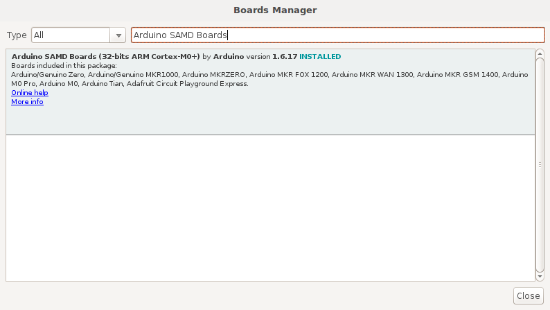
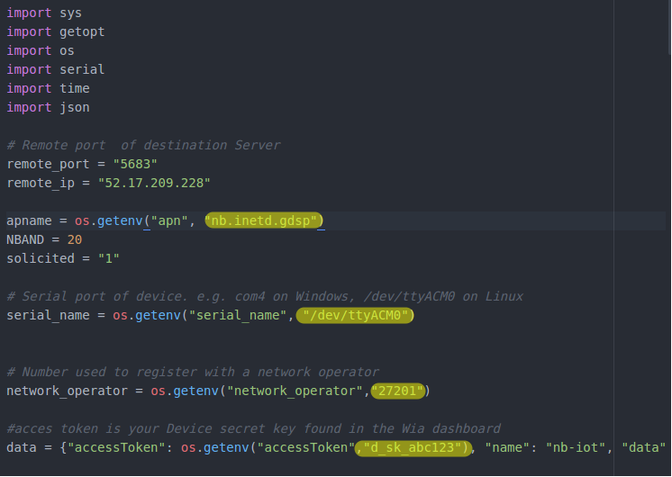
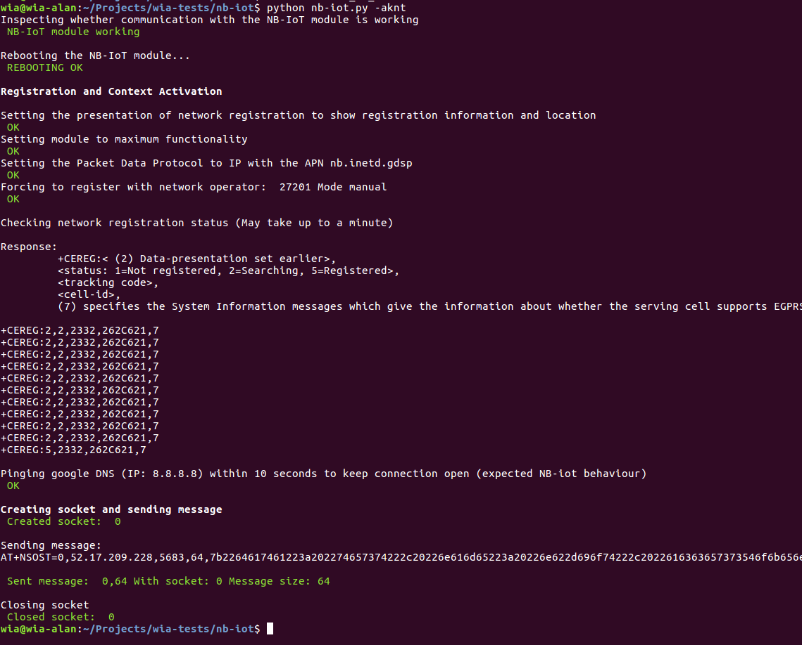

## Initial Setup of NB-IoT and Publishing an Event to Wia

In this tutorial, we're going through the initial steps to get setup with NB-IoT and publish an Event to Wia.


### Components
* [SODAQ SARA N211](https://shop.sodaq.com/en/sodaq-narrowband-board-n211.html)
* NB-IoT  compatible antenna
* [Crowduino M0](https://www.elecrow.com/crowduino-m0-sd-p-1649.html)
* NB-IoT  compatible sim

### Installing Python and Pyserial

If you haven’t already, you need to install the python language to complete this tutorial.

* https://www.python.org/downloads/
* Version 2.7.x
* Follow the download instructions for your operating system

Note: When using Windows, you'll need to add python to your path to make use of it anywhere in your OS. [Here](https://docs.python.org/2/using/windows.html#excursus-setting-environment-variables)

Now to install the `pyserial` library:
* For Windows, open power-shell and run `pip install pyserial` in the power-shell terminal.
* For Mac/Linux open a terminal and run `pip install pyserial` in the terminal.

In the rare case if `pip install pyserial` doesn't work, try the following instead:
```
python -m pip install pyserial
```

### Download the code
* For Windows, open power-shell in the location of your choosing and run `git clone git@github.com:wiaio/nb-iot-utilities.git` in the power-shell terminal.
* For Mac/Linux open a terminal in the location of your choosing  and run `git clone git@github.com:wiaio/nb-iot-utilities.git` in the terminal.

Alternatively you can download the zip file [here](https://github.com/wiaio/nb-iot-utilities)
* Extract the zip in the location of your choosing


### Finding your device's Serial port

#### Linux and Mac OS X
* Download and install the FTDI drivers from [here](https://www.silabs.com/products/development-tools/software/usb-to-uart-bridge-vcp-drivers). Select the appropriate version for your operating system and architecture.
* Open a terminal window and run the command `ls /dev/tty*`
* Look for a device with the name that begins with `/dev/tty` e.g. `/dev/tty.usbmodemPy343431` on MAC or `/dev/ttyUSB0`/`dev/ttyACM0` on Linux.

Note:
For Linux, you may need to run the two commands below. Once you've completed that, reboot your computer. This will add permissions that will allow you to upload a sketch to the board.

```
sudo usermod -a -G tty ${USER}
sudo usermod -a -G dialout  ${USER}
```

### Windows
* Download and install the FTDI drivers from [here](https://www.silabs.com/products/development-tools/software/usb-to-uart-bridge-vcp-drivers). Select the appropriate version for your operating system and architecture.
* Open the Windows start menu and search for `Device Manager`
* The COM port for the Pycom device will be listed as `USB Serial Device` or something similar
 * Keep note of the COM port (e.g. COM4)

### Uploading setup code to your Arduino
In order to communicate with your NB-IoT shield with your Arduino, you'll need to flash the Arduino with code that gives power to the Shield and provides a tunnel for the instructions.

* Install the Arduino IDE (Integrated development environment). This is where
You can download it for Mac OS X, Windows and Linux <a href="https://www.arduino.cc/en/main/software" target="_blank">here</a>.

In the Arduino IDE: 
* Go to menu:  `Tools > Board > Boards Manager`
* Search for `Arduino SAMD`. When found, click `Install` 



In the Arduino IDE: 

* Select the Arduino M0 board type by going to `Tools > Board`
* Select the port that displays `Arduino M0` 

* Now copy and paste the [intial_config.ino](SODAQ/SARA%20N211/intial_config.ino) code into the Arduino IDE
* Click `Upload` to flash the board

Now you should be ready to communicate to your shield.


### Updating nb-iot.py

Before we interface with our device, there are a few variables that need to be updated the file `nb-iot.py`.
In your favourite text editor, open `nb-iot.py` and:

* Find and replace the `serial_name` with the port obtained earlier in the tutorial
* Find and replace the `accessToken` with your device's secret key found in your Wia dashboard
* Find and replace the `apn` with your operators apn (Default: Vodafone Ireland)
* Find and replace the `network_operator` with your operators id (Default: Vodafone Ireland)  



### Interfacing with the device
* For Windows, in power-shell, run `python nb-iot.py -a` in the power-shell terminal.
* For Mac/Linux open a terminal and run `python nb-iot.py -a` in the terminal.

This command checks if the device is working with our code by running the simpliest command on the device (AT)

For a full list of commands available:
* For Windows, in power-shell, run `python nb-iot.py -h` in the power-shell terminal.
* For Mac/Linux open a terminal and run `python nb-iot.py -h` in the terminal.


### Publishing an Event to Wia
To publish an Event to Wia with your nb-iot device, run the following:
* For Windows, in power-shell, run `python nb-iot.py -aknt` in the power-shell terminal.
* For Mac/Linux open a terminal and run `python nb-iot.py -aknt` in the terminal.

This works by essentially:
* Checking if the code and interface with the device
* Resets the device
* Attaches the device to the network
* Opens a socket and sends a message via udp to Wia

The output should look like the image below:


### Common errors
Some devices might be on older firmware that's not compatible with the network you are trying to connect with. You can update your devices firmware by following the instructions [here](http://support.sodaq.com/sodaq-one/firmware-upgrade/)

If you are still having trouble connecting, contact your network operator to make sure your sim is correct and enabled.


### LICENSE

 Copyright (C) 2018 Wia (team@wia.io)

 Licensed under the Apache License, Version 2.0 (the "License");
 you may not use this file except in compliance with the License.
 You may obtain a copy of the License at

         http://www.apache.org/licenses/LICENSE-2.0

 Unless required by applicable law or agreed to in writing, software
 distributed under the License is distributed on an "AS IS" BASIS,
 WITHOUT WARRANTIES OR CONDITIONS OF ANY KIND, either express or implied.
 See the License for the specific language governing permissions and
 limitations under the License.
